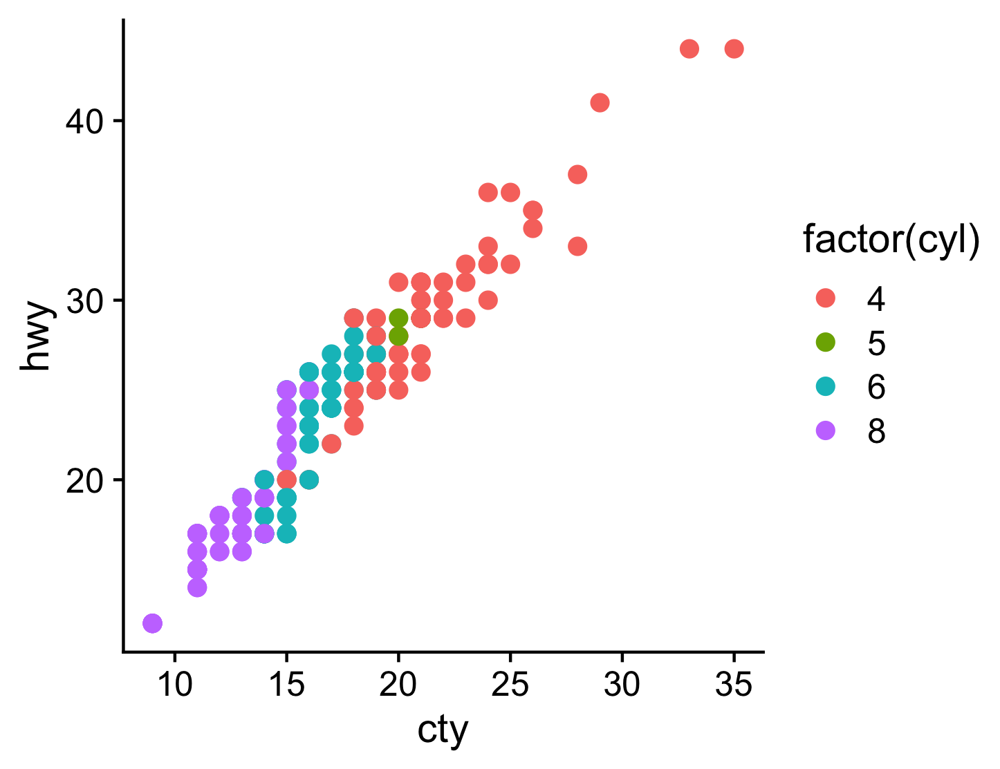

The **cowplot** package is a simple add-on to **ggplot2**. It is meant to provide a publication-ready theme for **ggplot2**, one that requires a minimum amount of fiddling with sizes of axis labels, plot backgrounds, etc. Its primary purpose is to give my students and postdocs an easy way to make figures that I will approve of. Thus, this package meets my personal needs and tastes. Yours may be different.

In addition to providing a modified plot theme, this package also offers functionality for custom annotations to **ggplot2** plots. It turns out that the easiest way to offer this functionality was to implement a general-purpose drawing canvas on top of **ggplot2**. As a result, you can achieve quite unusual effects with this package (see more below).  

The **cowplot** source code is available on github: [https://github.com/wilkelab/cowplot](https://github.com/wilkelab/cowplot)

# Plot design

I don't find the default **ggplot2** design particularly elegant. In particular, I don't like the gray background grid. I feel it often distracts from the data. For example, see this **ggplot2** visualization of the `mpg` data set:
```{r eval=FALSE}
library(ggplot2)
ggplot(mpg, aes(x = cty, y = hwy, colour = factor(cyl))) + 
   geom_point(size = 2.5)
```

```{r echo=FALSE, message=FALSE}
library(ggplot2)
ggplot(mpg, aes(x = cty, y = hwy, colour = factor(cyl))) + 
   geom_point(size = 2.5) + theme_gray()
```

I prefer a clean and sparse layout for publication. I also prefer the approach of building a graph by adding elements rather than taking them away. Therefore, the default design of **cowplot** has no grid at all. It looks similar to **ggplot2**'s `theme_classic()`, but there are a few important but subtle differences, mostly with respect to font sizes.

```{r eval=FALSE}
library(cowplot)
ggplot(mpg, aes(x = cty, y = hwy, colour = factor(cyl))) + 
   geom_point(size = 2.5)
```

```{r echo=FALSE, message=FALSE}
require(cowplot)
theme_set(theme_cowplot(font_size=12)) # default fontsize doesn't work well for online viewing
plot.mpg <- ggplot(mpg, aes(x = cty, y = hwy, colour = factor(cyl))) + 
  geom_point(size = 2.5)
plot.mpg
```

In particular, the **cowplot** default theme works nicely in conjunction with the `save_plot()` function the package provides, such that the output pdfs are nicely formatted and scaled and don't require any additional parameter fiddling:

```{r eval=FALSE}
library(cowplot)
plot.mpg <- ggplot(mpg, aes(x = cty, y = hwy, colour = factor(cyl))) + 
  geom_point(size=2.5)
# use save_plot() instead of ggsave() when using cowplot
save_plot("mpg.png", plot.mpg,
          base_aspect_ratio = 1.3 # make room for figure legend
)
```
```{r echo=FALSE, message=FALSE}
theme_set(theme_cowplot()) # switch to default font size for figure generation
plot.mpg <- ggplot(mpg, aes(x = cty, y = hwy, colour = factor(cyl))) + 
  geom_point(size=2.5)
# use save_plot() instead of ggsave() when using cowplot
save_plot("mpg.png", plot.mpg,
          base_aspect_ratio = 1.3 # make room for figure legend
)
theme_set(theme_cowplot(font_size=12)) # switch back for online figures
```


The resulting figure:

```{r echo=FALSE, out.width = "60%"}

```

By default, **cowplot** disables grid lines on the plot. In many cases, this is the cleanest and most elegant way to display the data. However, sometimes gridlines may be useful, and thus **cowplot** provides a simple way of adding gridlines, via the function `background_grid()`:
```{r message=FALSE}
plot.mpg + background_grid(major = "xy", minor = "none")
```

While the same result could be obtained using the function `theme()`, the function `background_grid()` makes the most commonly used option easily accessible. See the reference documentation for details.

Note that if you ever want to use the default **ggplot2** theme while using the **cowplot** package, simply add `theme_gray()` to your plot or call `theme_set(theme_gray())` to set this theme for all subsequent plots:
```{r eval=FALSE}
plot.mpg + theme_gray() # create plot with default ggplot2 theme
theme_set(theme_gray()) # switch to default ggplot2 theme for good
```


# Arranging graphs into a grid

One limitation of **ggplot2** is that it doesn't make it easy to add labels and other annotations to a plot. **ggplot2** strictly separates the *plot panel* (the part inside the axes) from the rest of the plot, and while it's generally straightforward to modify one or the other we cannot easily change both. To solve this issue in a generic way, **cowplot** implements a generic drawing layer on top of **ggplot2**. In this drawing layer, you can add arbitrary graphical elements on top of a graph. This concept will be discussed in detail in the next section. For now, let's discuss how this capability allows us to make nice compound plots.

The need for compound plots arises frequently when writing scientific publications. For example, let's assume we have created the following two plots, and we would like to combine them into a two-part figure with parts A and B. In our case, the plots are the following:
```{r message=FALSE}
plot.mpg <- ggplot(mpg, aes(x = cty, y = hwy, colour = factor(cyl))) + 
  geom_point(size=2.5)
plot.mpg
plot.diamonds <- ggplot(diamonds, aes(clarity, fill = cut)) + geom_bar() +
  theme(axis.text.x = element_text(angle=70, vjust=0.5))
plot.diamonds
```

**cowplot** allows us to combine them into one graph via the function `plot_grid()`: 
```{r message=FALSE, fig.width=7, fig.height=2.5}
plot_grid(plot.mpg, plot.diamonds, labels = c("A", "B"))
```

By default, the plots are simply placed into the grid as they are, and so the axes are not aligned. If axis alignment is required, it can be switched on via the `align` option:
```{r message=FALSE, fig.width=7, fig.height=2.5}
plot_grid(plot.mpg, plot.diamonds, labels = c("A", "B"), align = "h")
```

The function `plot_grid()` will attempt to achieve a reasonable layout of the plots provided. However, you can precisely manipulate the layout by specifying the number of rows or columns or both:
```{r message=FALSE, fig.width=7, fig.height=5}
plot_grid(plot.mpg, NULL, NULL, plot.diamonds, labels = c("A", "B", "C", "D"), ncol = 2)
```

```{r message=FALSE, fig.width=4, fig.height=5}
plot_grid(plot.mpg, plot.diamonds, labels = c("A", "B"), nrow = 2, align = "v")
```

The function `plot_grid()` works nicely in combination with the function `save_plot()`, which can be told
about the grid layout. For example, if we want to save a 2-by-2 figure, we might use this code:
```{r eval=FALSE}
plot2by2 <- plot_grid(plot.mpg, NULL, NULL, plot.diamonds,
                      labels=c("A", "B", "C", "D"), ncol = 2)
save_plot("plot2by2.png", plot2by2,
          ncol = 2, # we're saving a grid plot of 2 columns
          nrow = 2, # and 2 rows
          # each individual subplot should have an aspect ratio of 1.3
          base_aspect_ratio = 1.3
          )
```
```{r echo=FALSE, message=FALSE}
theme_set(theme_cowplot()) # switch to default font size for figure generation
plot2by2 <- plot_grid(plot.mpg, NULL, NULL, plot.diamonds,
                      labels=c("A", "B", "C", "D"), ncol = 2)
save_plot("plot2by2.png", plot2by2,
          ncol = 2, # we're saving a grid plot of 2 columns
          nrow = 2, # and 2 rows
          # each individual subplot should have an aspect ratio of 1.3
          base_aspect_ratio = 1.3
          )
theme_set(theme_cowplot(font_size=12)) # switch back for online figures
```

The resulting figure:
```{r echo=FALSE, out.width = "100%"}
knitr::include_graphics("plot2by2.png")
```

The advantage of saving figures in this way is that you can first develop the code for individual figures, and once each individual figure looks the way you want it to you can easily combine the figures into a grid. `save_plot()` will make sure to scale the overall figure size such that the individual figures look the way they do when saved individually (as long as they all have the same `base_aspect_ratio`).


# Generic plot annotations

Finally, let's discuss how we can use **cowplot** to create more unusual plot designs. For example, let's take the mpg image from the previous section, label it with an A in the top-left corner, and mark it as a draft:
```{r message=FALSE}
ggdraw(plot.mpg) + 
  draw_plot_label("A", size = 14) + 
  draw_label("DRAFT!", angle = 45, size = 80, alpha = .2)
```

The function `ggdraw()` sets up the drawing layer, and functions that are meant to operate on this drawing layer all start with `draw_`. The resulting object is again a standard **ggplot2** object, and you can do with it whatever you might do with a regular **ggplot2** plot, such as save it with `ggsave()`. [However, as mentioned before, I recommend using `save_plot()` instead.]

In fact, because `ggdraw()` produces a standard **ggplot2** object, we can draw on it with standard geoms if we want to. For example:
```{r message=FALSE}
t <- (0:1000)/1000
spiral <- data.frame(x = .45+.55*t*cos(t*15), y = .55-.55*t*sin(t*15), t)
ggdraw(plot.mpg) + 
  geom_path(data = spiral, aes(x = x, y = y, colour = t), size = 6, alpha = .4)
```

I don't know if this is useful in any way, but it shows the power of the approach.

Importantly, though, in all cases discussed so far, the main plot was below all other elements. Sometimes, you might want the plot on top. In this case, you can initialize an empty drawing canvas by calling `ggdraw()` without any parameters. You then place the plot by calling `draw_plot()`. Notice the difference in the two plots produced by the following code:
```{r message=FALSE, warning=FALSE, fig.show="hold"}
boxes <- data.frame(
  x = sample((0:33)/40, 40, replace = TRUE),
  y = sample((0:33)/40, 40, replace = TRUE)
)
# plot on top of annotations
ggdraw() + 
  geom_rect(data = boxes, aes(xmin = x, xmax = x + .15, ymin = y, ymax = y + .15),
            colour = "gray60", fill = "gray80") +
  draw_plot(plot.mpg) +
  draw_label("Plot is on top of the grey boxes", x = 1, y = 1,
            vjust = 1, hjust = 1, size = 10, fontface = 'bold')
# plot below annotations
ggdraw(plot.mpg) + 
  geom_rect(data = boxes, aes(xmin = x, xmax = x + .15, ymin = y, ymax = y + .15),
            colour = "gray60", fill = "gray80") + 
  draw_label("Plot is underneath the grey boxes", x = 1, y = 1,
            vjust = 1, hjust = 1, size = 10, fontface = 'bold')
```

Note that placing a plot on top of annotations only makes sense if the plot background is transparent. This is one of the main differences between `theme_cowplot()` and `theme_classic()`. If you tried the same example with `theme_classic()`, the gray boxes underneath the plot would not show.

The `draw_plot()` function also allows us to place graphs at arbitrary locations and at arbitrary sizes onto the canvas. This is useful for combining subplots into a layout that is not a simple grid, e.g. with an inset plotted inside a larger graph.
```{r message=FALSE, fig.width=7, fig.height=6}
# plot.mpg and plot.diamonds were defined earlier
library(viridis)
ggdraw() +
  draw_plot(plot.diamonds + theme(legend.justification = "bottom"), 0, 0, 1, 1) +
  draw_plot(plot.mpg + scale_color_viridis(discrete = TRUE) + 
              theme(legend.justification = "top"), 0.5, 0.52, 0.5, 0.4) +
  draw_plot_label(c("A", "B"), c(0, 0.5), c(1, 0.92), size = 15)
```

We can also combine plots and images, using the function `draw_image()`. This function, which requires the **magick** package to be installed, can take images in many different formats and combine them with **ggplot2** plots. For example, we can use an image as a plot background:


```{r message=FALSE}
p <- ggplot(iris, aes(x=Sepal.Length, fill=Species)) + geom_density(alpha = 0.7)
ggdraw() +
  draw_image("http://jeroen.github.io/images/tiger.svg") +
  draw_plot(p)
```

We can also make a plot grid with a regular plot and an image:

```{r message=FALSE, fig.width=7, fig.height=2.5}
p <- ggplot(iris, aes(x = Sepal.Length, fill = Species)) + geom_density(alpha = 0.7)
p2 <- ggdraw() + draw_image("http://jeroen.github.io/images/tiger.svg", scale = 0.9)
plot_grid(p, p2, labels = "AUTO")
```
